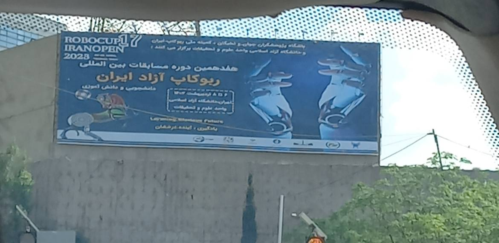

## المقدمة
في عام 2023، تنافست في **كأس إيران المفتوحة 2023 روبوكب** في *طهران* في دوري **RCJ لكرة القدم الخفيفة** مع فريقي **After X**. حققنا **المركز الأول** و مثلنا إيران في مسابقة **بوردو**.

---

## روبوتنا
كان لدينا روبوتان بنفس التصميم الميكانيكي والكهربائي ولكن مع كود مختلف (أحدهما كحارس مرمى والآخر كمهاجم).

---

## المواصفات

### المعالج
دماغ الروبوت هو **STM32F405RGT6**، والذي يعمل بتردد *168 ميجاهرتز*!!!

### المحركات
استخدمت روبوتاتنا محرك **Maxon DCX16L**، الذي يتمتع بحساسية عالية ويمكنه الوصول إلى سرعات تصل إلى 1000RPM بقراءة 9 فولت.

### محركات القيادة
لتشغيل **Maxon DCX16L**، استخدمنا محركات **TB12FNG** لكل محرك (4 محركات إجمالاً).

### الحركة
كانت حركة الروبوت تتم باستخدام تقنية **حركة عجلتين OmniDirectional**، والتي تسمح للروبوت بالتحرك في **أي** اتجاه.

### التعرف على الكرة
تم العثور على الكرة في الملعب، التي هي كرة مُرسلة بالأشعة تحت الحمراء، باستخدام **أجهزة استشعار TSSP** في نمط دائري.

### التعرف على الخروج
إذا خرج الروبوت عن الحدود (الخط الأبيض حول الملعب)، فإن ذلك سيكون خطأ، لذا قمنا بوضع مصفوفة دائرية من **أجهزة استشعار NJL** لاكتشاف الخط الأبيض.

### اكتشاف الهدف
كان لدى روبوت المهاجم كاميرا **OpenMV Cam H7** واحدة لاكتشاف الهدف، بحيث عندما تكون الكرة في فم الروبوت، يتجه الروبوت نحو الهدف.

---

## المعرض

منشور مركز فازلي للأبحاث 
  
---
### إحدى مبارياتنا


### الصور


  
  
  
  
  
  

