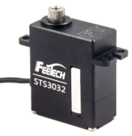
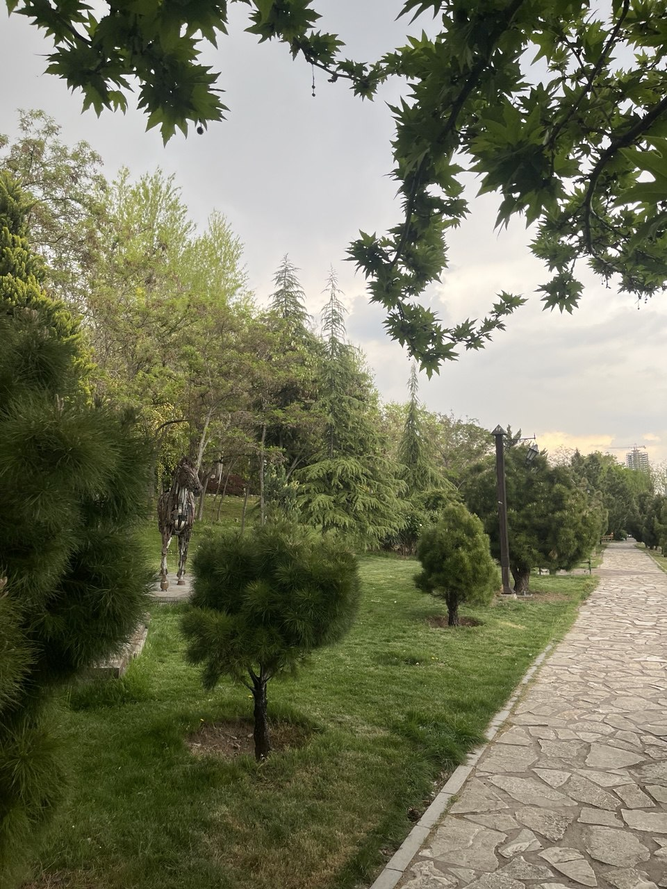

## المقدمة
في روبوكب هذا العام، اتخذنا نهجًا مختلفًا واختارنا **الإنقاذ** بدلاً من كرة القدم. هذا العام تنافسنا في **متاهة الإنقاذ RCJ**، ولكننا نخطط للمنافسة في **خط الإنقاذ** العام المقبل.

---

## المواصفات

### المعالج
دماغ الروبوت هو **راسبيري باي 4** و **أردوينو ميكرو**.

### محركات السيرفو
استخدم روبوتنا **Feetech STS3032**، وهو سيرفو ذكي تسلسلي من نوع TTL.

### الكاميرا
على جانبي الروبوت، توجد **كاميرا وحدة V** تستخدم لتحديد المصابين (اللون والحروف).
يتم معالجة الصور داخل الكاميرا نفسها، ويتم تخزين الكود بايثون مباشرة في الكاميرا الميكرو.

### خوارزمية حل المتاهة
يبدأ الروبوت في استكشاف المتاهة باستخدام خوارزمية البحث المتعمق **(DFS)**.
عند فحص المتاهة بالكامل، إذا كان هناك وقت كافٍ للعودة إلى نقطة البداية، سيعود الروبوت إلى نقطة البداية وينهي الجولة.

يتم استكشاف المتاهة باستخدام البحث المتعمق مع إعطاء الأولوية للتوجيهات.
في هذه الخوارزمية، يتم تمثيل المتاهة على أنها رسم بياني، ويبحث الروبوت عن الرؤوس بأعمق قدر ممكن.

### جهاز إسقاط طقم الإنقاذ
جهاز إسقاط الطقم في هذا الروبوت هو جهاز صغير وملائم مستوحى من المسدس.

---

## المعرض

### صور


  
  
  
  
  

