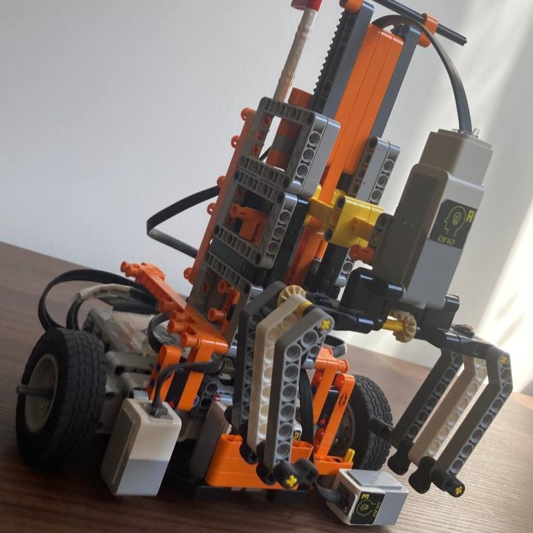
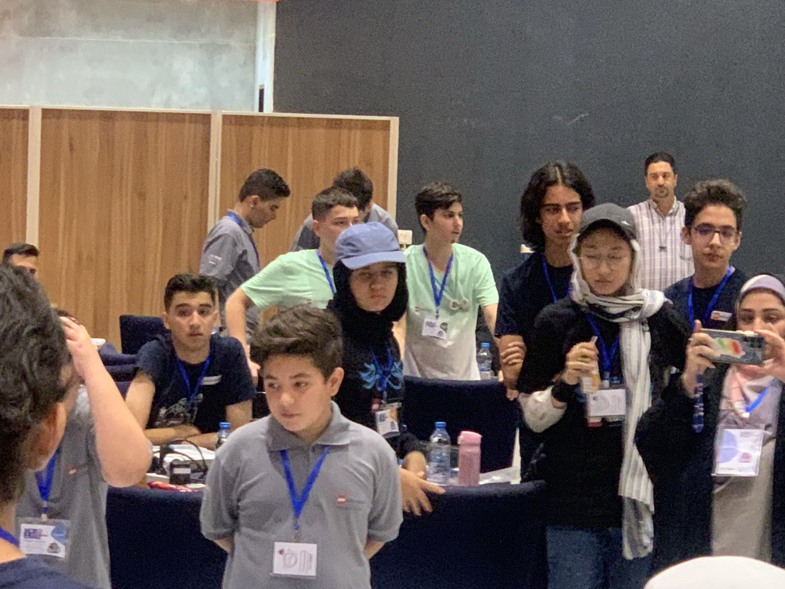

## المقدمة
اليوم كان *WRO إيران 2023* في *شيراز*. شاركت أنا وفريقي في دوري روبوميشين سينير. حققنا *المركز الأول* ونلنا *الميدالية الذهبية*.

---

## السيناريو
تعتمد مجتمعاتنا الحديثة على شحن الحاويات التي تنقل جميع أنواع البضائع عبر المحيطات. في الماضي، كانت بعض الطرق تتطلب من السفن أن تقوم برحلات طويلة وخطرة حول أطراف القارات، مثل حول *كيب هورن* في أمريكا الجنوبية أو *كيب هوب* في أفريقيا. لكن بناء قناة بنما وقناة السويس جعل من الممكن للسفن الوصول إلى وجهاتها بسرعة وأمان أكبر. تم بناء العديد من سفن النقل الحديثة وفقًا للمعيارين: *باناماكس* أو *نيوباناماكس*، وهو الحد الأقصى لحجم السفن لعبور قناة بنما.

أصبحت المعايير والأتمتة جوانب أخرى جعلت النقل الدولي عبر البحر أكثر كفاءة. قدمت الحاويات القياسية مثالًا على هذه المعايير. يمكن نقل هذه الحاويات بسهولة من السفينة إلى الشاحنة أو القطار، مما يجعل النقل أسرع. في الموانئ الحديثة، يتم أتمتة العديد من العمليات، مثل تفريغ السفن الحاويات وحتى توجيه السفن. السفن الذاتية القيادة هي أيضًا شيء نتوقع رؤيته في المستقبل القريب.

في مجال لعبة السينير، سيساعد الروبوت في تحميل وتفريغ السفن، وتزويدها بالوقود، وقيادتها إلى البحر المفتوح.

---

## روبوتنا
معظم الروبوتات في مسابقة WRO يتم إنشاؤها باستخدام [ليغو EV3 مايندستورمز](https://www.lego.com/en-us/product/lego-mindstorms-ev3-31313)، وكان روبوتنا كذلك.

### المواصفات
كان المعالج الرئيسي لروبوتنا هو EV3. كان لدينا ثلاثة محركات متوسطة، ومحرك كبير، وأربعة حساسات لونيّة-IR.

### التصميم
تم برمجة الروبوت باستخدام [برنامج ليغو مايندستورمز EV3](https://drive.google.com/file/d/15V1uK9sR5uAZCJJwds-hjwky9jYOFbDg/view?usp=sharing)، وتم التصميم باستخدام [Brick Studio 2.0](https://www.bricklink.com/v3/studio/download.page).

تم صنع القبضة باستخدام نظام التروس، وكان الخوارزم الذي استخدمناه لتتبع الخط هو خوارزمية PID.

---

## المعرض

### أحد اختباراتنا


### الصور

  
  
  
  
  
  
  

