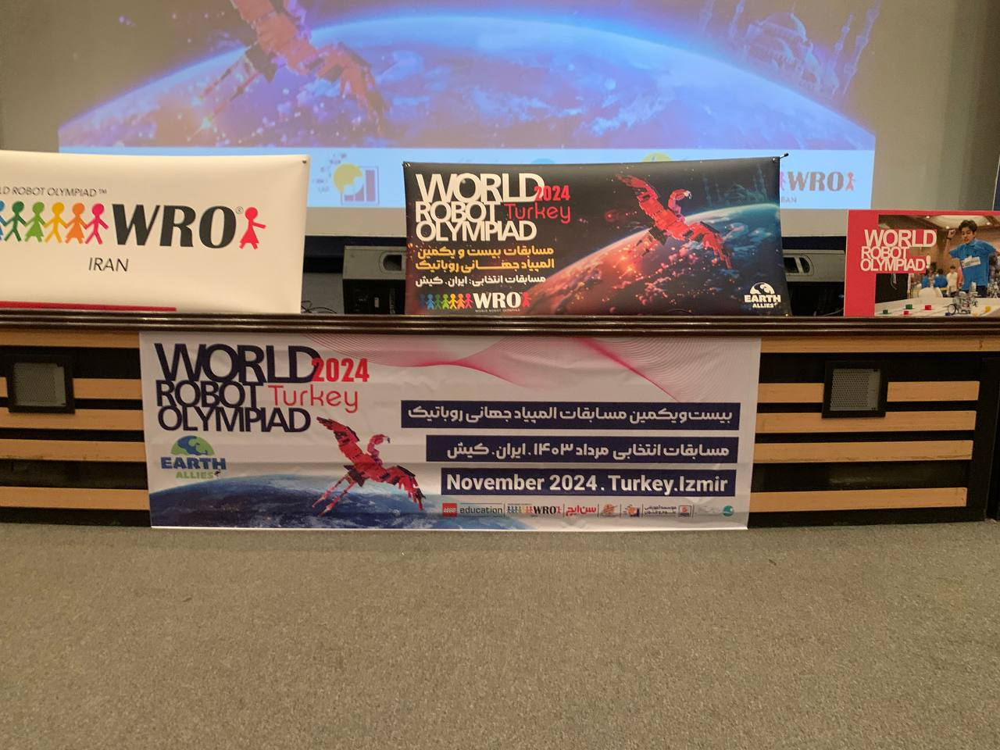
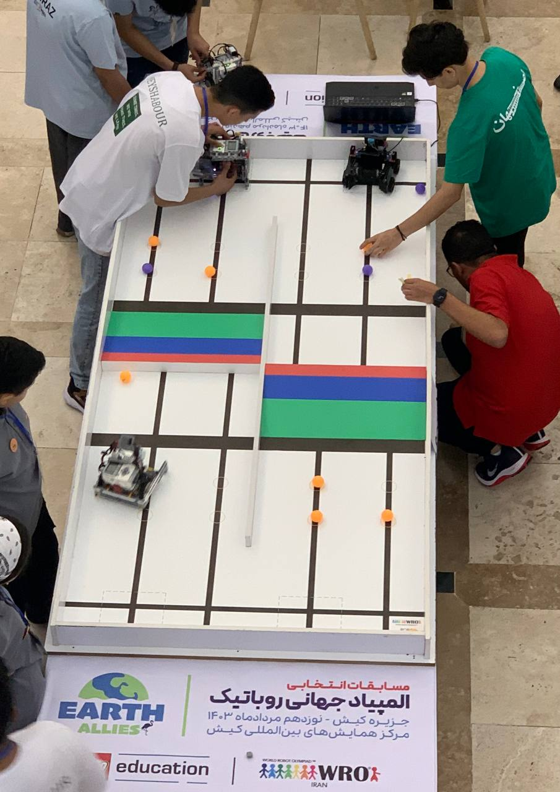

## المقدمة
اليوم، شاركت في WRO إيران 2024 في *جزيرة كيش* في دوري روبوسبورتس تنس مزدوج. حققنا *المركز الثالث* ونلنا *الميدالية البرونزية*.

## السيناريو
**تنس مزدوج**:  
تتضمن كل مباراة من التحدي فريقين من الطلاب. كل فريق يحضر روبوتين. يعمل كلا الروبوتين على نفس نصف الملعب، وهدفهم هو التعاون في مهمة مشتركة – دفع جميع الكرات البرتقالية من نصفهم إلى نصف الفريق الآخر.



## روبوتنا
### المواصفات  
استخدم روبوتنا **Arduino Leonardo** كمعالج، وأربعة محركات DC صفراء عادية للحركة، ومحركين DC للمُرسل، و **كاميرا AI من UnitV** لاكتشاف الكرات.


### التصميم  
تم تصميم PCB باستخدام **ALtium Designer**، و *CAD* تم باستخدام **SolidWorks**. تم استخدام *IDE* الخاص بـ **Arduino IDE**.



### تصميم المُرسل  
تم تصميم المُرسل بشكل يشبه المقلاع، باستخدام القوة الدورانية لرفع الكرة ورميها للأمام.

### الخوارزمية  
عندما يبدأ الروبوت، يقوم بعمل مسح لتحديد موقع *الكرة الأرجوانية*. بناءً على الموقع، يتم تنفيذ مجموعة من التعليمات لدفع *الكرة البرتقالية* من جانبنا مع الحفاظ على *الكرة الأرجوانية*. بعد ذلك، ينتقل الروبوت إلى *وضع الكاميرا*، حيث تقوم الكاميرا بإنشاء **خطة (X,Y)**. بناءً على موقع *الكرة البرتقالية*، يتم اتخاذ الإجراءات التالية:

```C
if (orange_y_coord > 50) {
    LEFT(90);
  } else if (orange_y_coord < -50) {
    RIGHT(90);
  } else if (orange_y_coord >= -50 && orange_y_coord <= 50 && orange_y_coord !=0) {
    FORWARDKICK();
  }
```


## المعرض

### مثال على الخوارزمية


### الصور

  
  
  
  
  
  
  

