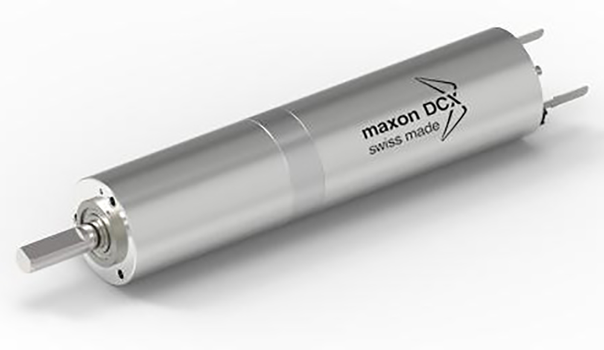
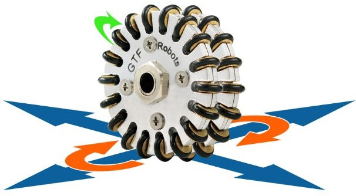
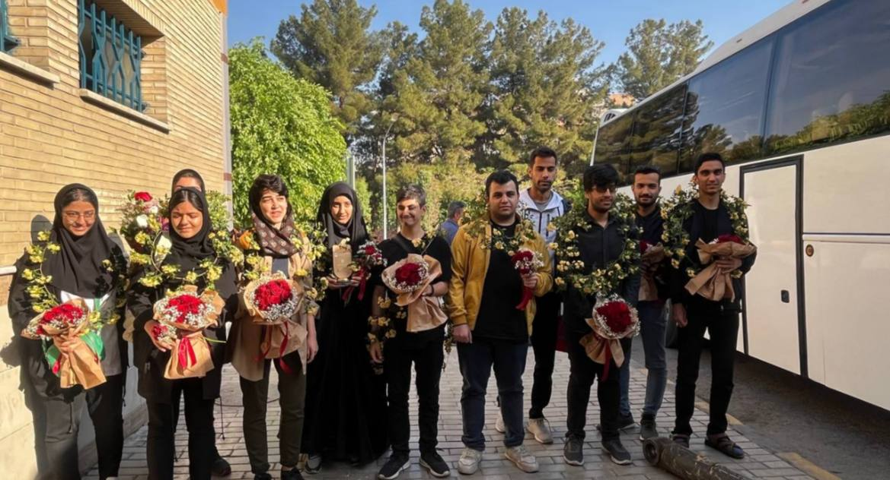
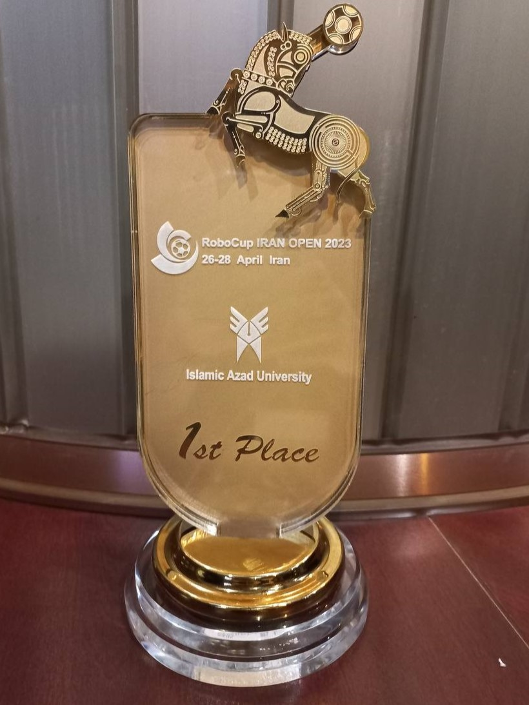

## Intro
Back in 2023, I competed in the IranOpen 2023 RoboCup in *Tehran* for the RCJ Lightweight Soccer league with my team **After X**. We achieved **First Place** and represented Iran in the Bordeaux competition.

---

## Our Robot
We had two robots with the same mechanical and electrical design but different code (one as goalkeeper and the other as an attacker).

---

## Specs

### Micro
The brain of the robot is a **STM32F405RGT6**, which is *168MHz*!!!

### Motors
Our robots used the **Maxon DCX16L**, which is very sensitive and can reach speeds of up to 1000RPM with a 9V reading.

### Motor Drivers
To drive the **Maxon DCX16L**, we used **TB12FNG** drivers for each motor (4 in total).

### Movement
The robot's movement was done with something called **4-wheel OmniDirectional Movement**, which allows the robot to move in **any** direction.

### Ball Recognition
Finding the ball on the field, which is an IR emitter ball, was done using **TSSP sensors** in a circular pattern.

### Out Recognition
If the robot went out of the outline (white line around the field), it would be a foul, so we put a circular array of **NJL sensors** to detect the white line.

### Goal Detection
The attacker robot had one **OpenMV Cam H7** and detected the goal so that when we had the ball in our robot's mouth, it would go toward the goal.

---

## Gallery

Fazili RC post


### One of our games


### Photos


  
  
  
  
  
  

