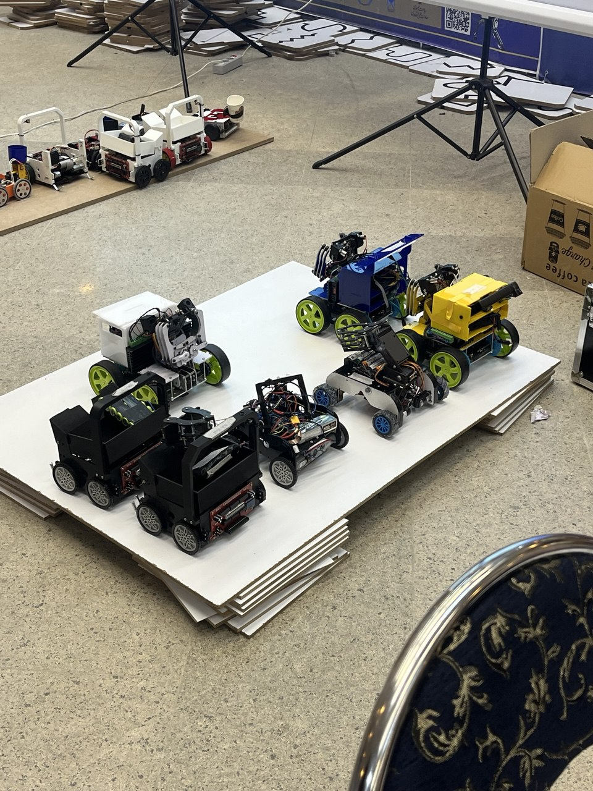
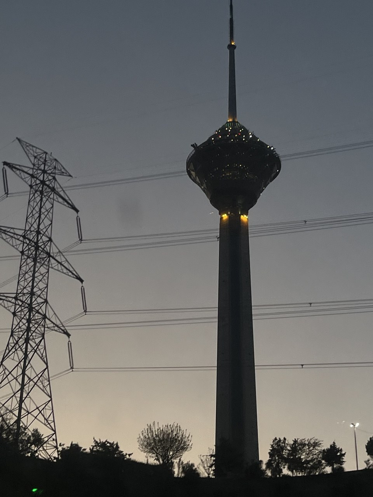
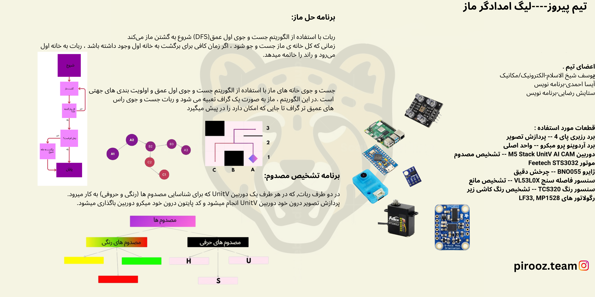

## Intro
In this year's RoboCup, we took a different approach and chose Rescue instead of Soccer. This year we competed in RCJ **Rescue Maze**, but next year we are planning to compete in **Rescue Line**.

---

## Specs

### Micro
The brain of the robot is a **Raspberry Pi 4** and an **Arduino Micro**.

### Servo Motors
Our robot used the **Feetech STS3032**, which is a TTL smart serial servo.

### Camera
On both sides of the robot, there is a **Unit V** camera used to identify the injured (color and letters).  
The image processing is done inside the **Unit V** camera itself, and the Python code is stored directly in the micro camera.

### Maze Solving Algorithm
The robot starts exploring the maze using the depth-first search **(DFS)** algorithm.  
When the entire maze is searched, if there is enough time to return to the starting point, the robot will go back to the starting point and end the round.

Maze exploration is done using depth-first search with directional prioritization.  
In this algorithm, the maze is modeled as a graph, and the robot searches for vertices as deeply as possible.

### Rescue Kit Dropper
The kit dropper in this robot is a small and compact contraption inspired by a revolver.

---

## Gallery

### Photos


  
  
  
  
  

