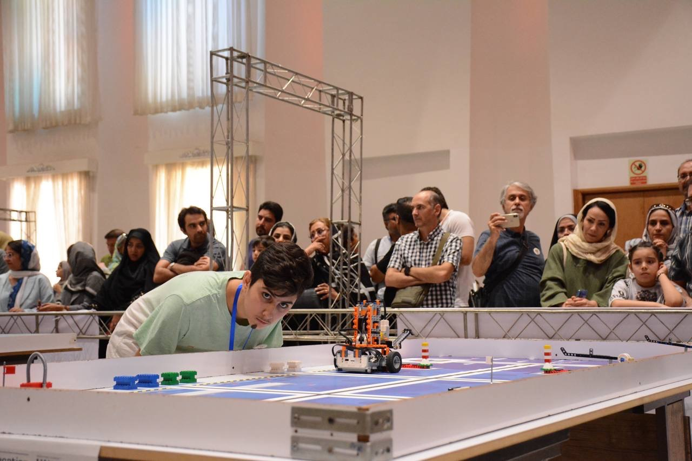

## Intro
Today was the WRO Iran 2023 in *Shiraz*. My team and I competed in the RoboMission Senior league. We achieved *First Place* and earned the *Gold medal*.

---

## Scenario
Our modern-day society relies on container shipments that transport all kinds of goods over the oceans. In the past, particular routes would involve ships having to take long, dangerous journeys around the edges of continents, such as around Cape Horn in South America or the Cape of Good Hope in Africa. But the construction of the Panama Canal and the Suez Canal have made it possible for ships to reach their destinations much faster and more safely. Many modern transport ships have even been built exactly according to the Panamax or the new Neopanamax standard: the maximum size for crossing the Panama Canal.

Standardization and automation are other aspects that have made international transport over the sea more effective. The introduction of standard shipping containers is an example of this standardization. These containers can easily be transferred from a ship to a truck or a train, making transportation faster. In modern ports, many processes are automated, such as the unloading of containerships and even piloting of ships. Autonomous ships are even something we can expect to see in the near future.

On the Senior game field, the robot will help to load and unload ships, fuel them, and pilot them to open sea.

---

## Our Robot
Most of the robots in the WRO competition are made with [Lego EV3 Mindstorms](https://www.lego.com/en-us/product/lego-mindstorms-ev3-31313), and so was ours.

### Specs
The main processor of our robot was an EV3. We had three medium motors, a large motor, and four color-IR sensors.

### Design
The coding of the robot was done with the [Lego Mindstorms EV3 Software](https://drive.google.com/file/d/15V1uK9sR5uAZCJJwds-hjwky9jYOFbDg/view?usp=sharing), and the design was done with [Brick Studio 2.0](https://www.bricklink.com/v3/studio/download.page).

The gripper was made with a rack system, and the line follower algorithm used was the PID algorithm.

---

## Gallery

### One of our test runs


### Photos

  
  
  
  
  
  
  

