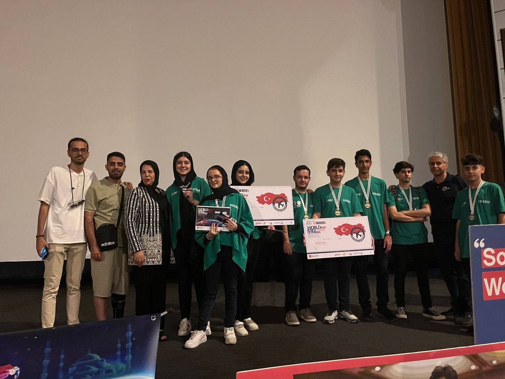

## Intro
Today I competed in the WRO Iran 2024 on *Kish Island* for the RoboSports Double Tennis league. We achieved *Third Place* and earned the *Bronze medal*.

## Scenario
**Double-Tennis**:  
Each match of the challenge involves two teams of students. Each team prepares two robots. Both robots operate on the same half of the field, and their goal is to collaborate on a common task – push all the orange balls from their half to the other team’s half.



## Our Robot
### Specs  
Our robot used an **Arduino Leonardo** for the processor, four regular Yellow DC Motors for movement, two DC Motors for the kicker, and a **UnitV AI cam** for ball detection.


### Design  
The PCB design was done using **ALtium Designer**, and the *CAD* was done with **SolidWorks**. The *IDE* we used was the **Arduino IDE**.



### Kicker Design  
The kicker is made like a catapult, using spinning force to pick the ball up and throw it forward.

### Algorithm  
When the robot started, it would perform a scan to determine the position of the *purple ball*. Based on the position, a set of instructions would be executed to push the *orange ball* off our side while keeping the *purple ball*. After that, the robot would switch into *camera mode*, where the camera would create an **(X,Y)** plane. Based on the position of the *orange ball*, the following actions would be taken:

```C
if (orange_y_coord > 50) {
    LEFT(90);
  } else if (orange_y_coord < -50) {
    RIGHT(90);
  } else if (orange_y_coord >= -50 && orange_y_coord <= 50 && orange_y_coord !=0) {
    FORWARDKICK();
  }
```


## Gallery

### One of the algorithm examples


### Photos

  
  
  
  
  
  
  

