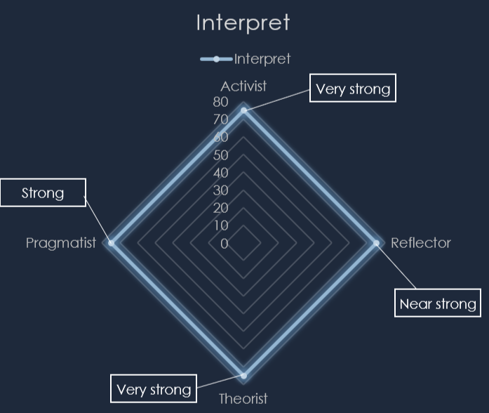

# Profile 
I achieved first place in the 2023 RoboCup
IranOpen(secondary lightweight soccer)
competition in which I was granted the
opportunity to compete in Bordeaux France.
After that I secured first place in Iran’s WRO
Senior RoboMission and won the gold medal
and in 2024 I achieved third place the WRO
RoboSports. I have strong skills in designing
PCB’s (Printed-Circuit-Board) using Altium
Designer and design and print 3D parts with
SolidWorks and simplify3D. In terms of coding,
I am proficient in AVR, STM32, Lego EV3
Mindstorms, Python and Arduino. I have the
ability to make 3D printers, CNC machines,
aeroponic and hydroponic farming system, and
more. Apart from my technical ability I am a
quick learner and I also posses talents in music
and sports.

---

## Education










---

## Work experience 
I have worked in places such as **freelance** and **fiverr** as mechanic and electronic designers.
In addition to that I have worked with [**SNOWA**](http://localhost:1313/projects/snowa/
) in automating some of the production line.

---

## Abilities and skills 

---

### Design various devices such as :
* RoboCup robots
* WRO robots
* Aeroponic/hydroponic system
* 3D printer/CNC machine
* Smart home/smart school systems
* Soldering station
* Anti thieft alarm 
* Voltage supply
* MIDI devices
* Electric-Guitar effect pedals
* Electric-Guitar/Bass amplifier
* Automation robots
* 9 Axis-arm
and more

---

### Interpersonal abilities :
* Problem solving
* Good in teamwork
* Creative
* Empathic
* Flexible
* Ability to work under pressure
* Good at leadership
* Good at communicating
* Good at time management
* Great attention to details

---

### Computer abilities :
* VSC
* Python
* Microsoft Office
* Adobe photoshop
* WordPress
* Hugo
* CVAVR
* ArduinoIDE
* Lego MindStorms
* Scratch
* Altium Designer
* SolidWorks
* AutoCad
* Simplify3D
* Cura
* Internet surfing

---

### Languages :
* English (native)
* Farsi (native)
* Arabic (simple)
* Geramn (basic knowledge)
* Italian (learning)
* Slovenian (lerning)

---

### Arts & music :
* Electric Guitar 
* Violin
* Drums
* Piano

---

### Athletic skills :
* Volleyball
* Judo
* Tennis
* Ping Pong (Table Tennis)
* Basketball 

---

## Coding skills :

type: 'bar',
data: {
  labels: ['Python', 'Arduino', 'EV3', 'STM', 'AVR'],
  datasets: [{
    label: 'Skill in Coding Language (%)',
    data: [65, 80, 75, 20, 45],
  }]
}


---

## Study Skills Audit result :
