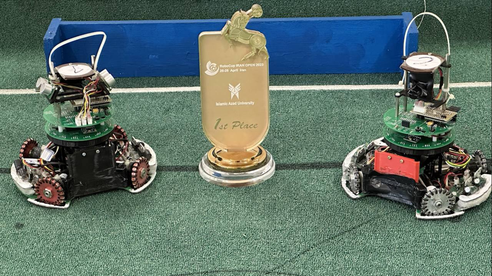
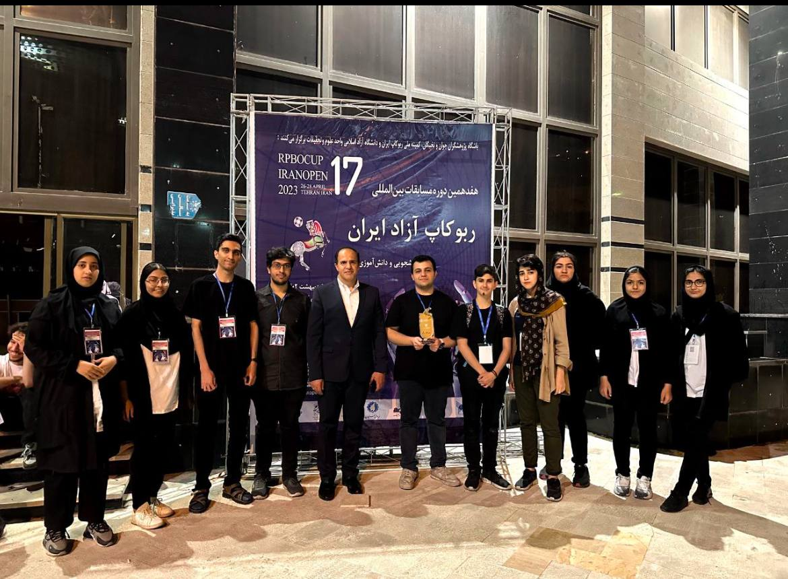
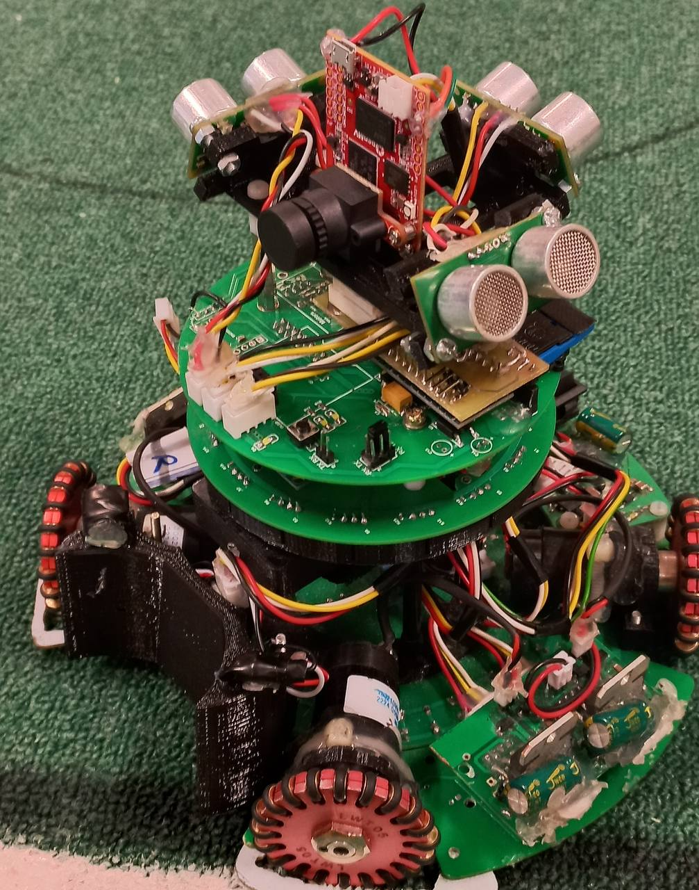

## مقدمه
در سال 2023، من به همراه تیم **After X** در رقابت‌های RoboCup ایرانOpen 2023 در *تهران* در لیگ فوتبال سبک RCJ شرکت کردم. ما به **اولین مقام** دست یافتیم و نماینده ایران در رقابت‌های بوردو بودیم.

---

## ربات ما
ما دو ربات با طراحی مکانیکی و الکتریکی یکسان داشتیم، اما کد متفاوتی (یکی در نقش دروازه‌بان و دیگری در نقش مهاجم).

---

## مشخصات

### میکرو
مغز ربات ما یک **STM32F405RGT6** است که *168MHz* سرعت دارد!!!

### موتور
ربات‌های ما از **Maxon DCX16L** استفاده کردند که بسیار حساس است و می‌تواند با خوانش 9V به سرعت‌های تا 1000RPM برسد.

### درایورهای موتور
برای راه‌اندازی **Maxon DCX16L**، از درایورهای **TB12FNG** برای هر موتور (در مجموع 4 عدد) استفاده کردیم.

### حرکت
حرکت ربات با استفاده از تکنولوژی **حرکت OmniDirectional چهارچرخ** انجام شد که به ربات این امکان را می‌دهد که در **هر** جهتی حرکت کند.

### شناسایی توپ
یافتن توپ در میدان که یک توپ با فرستنده IR است، با استفاده از حسگرهای **TSSP** به صورت دایره‌ای انجام می‌شد.

### شناسایی خارج شدن
اگر ربات از محدوده خط سفید اطراف میدان خارج می‌شد، خطا بود. به همین دلیل یک آرایه دایره‌ای از **حسگرهای NJL** برای شناسایی خط سفید قرار دادیم.

### شناسایی دروازه
ربات مهاجم یک **OpenMV Cam H7** داشت که دروازه را شناسایی می‌کرد، بنابراین وقتی توپ در دهان ربات قرار می‌گرفت، به سمت دروازه حرکت می‌کرد.

---

## گالری

پست پژوهشسرای فضیلی

---
### یکی از بازی‌های ما


### تصاویر


  
  
  
  
  
  
