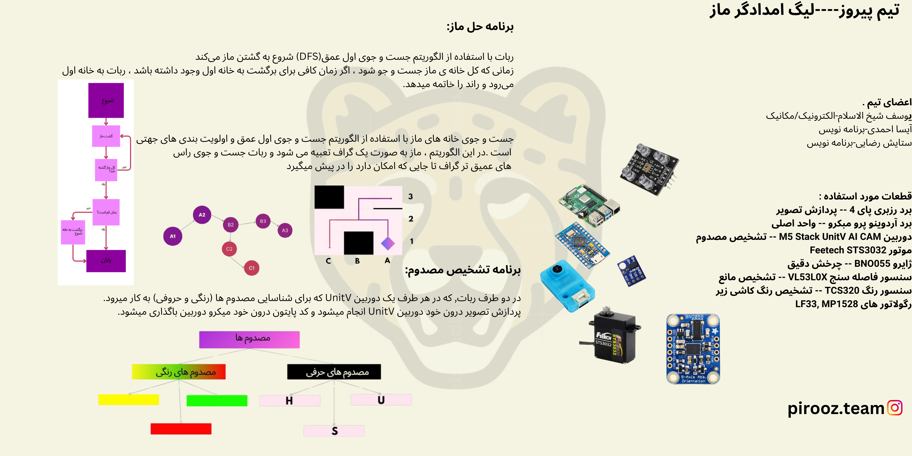

## مقدمه
در رقابت‌های RoboCup امسال، ما رویکرد متفاوتی اتخاذ کردیم و به جای فوتبال، به رقابت در لیگ **Rescue Maze** پرداختیم. امسال در این لیگ رقابت کردیم و سال آینده قصد داریم در لیگ **Rescue Line** شرکت کنیم.

---

## مشخصات

### میکرو
مغز ربات ما یک **Raspberry Pi 4** و یک **Arduino Micro** است.

### موتورهای سروو
ربات ما از **Feetech STS3032** که یک سروو سریال هوشمند TTL است، استفاده کرد.

### دوربین
در هر دو طرف ربات، یک دوربین **Unit V** برای شناسایی مجروحین (رنگ و حروف) قرار دارد.  
پردازش تصویر به طور داخلی در خود دوربین **Unit V** انجام می‌شود و کد پایتون مستقیماً در خود دوربین ذخیره شده است.

### الگوریتم حل ماز
ربات ابتدا با استفاده از الگوریتم جستجوی عمق اول **(DFS)** شروع به کاوش در ماز می‌کند.  
وقتی که تمام ماز جستجو شد، اگر وقت کافی برای بازگشت به نقطه شروع وجود داشته باشد، ربات به نقطه شروع برگشته و دور را تمام می‌کند.

کاوش در ماز با استفاده از جستجوی عمق اول و اولویت‌دهی به جهت‌ها انجام می‌شود.  
در این الگوریتم، ماز به عنوان یک گراف مدل می‌شود و ربات سعی می‌کند به عمق بیشتری از رأس‌ها برسد.

### دستگاه رهاسازی کیت نجات
دستگاه رهاسازی کیت در این ربات یک دستگاه کوچک و فشرده است که از یک سیستم مشابه به یک ربات پرچم‌زن الهام گرفته شده است.

---

## گالری

### تصاویر


  
  
  
  
  
