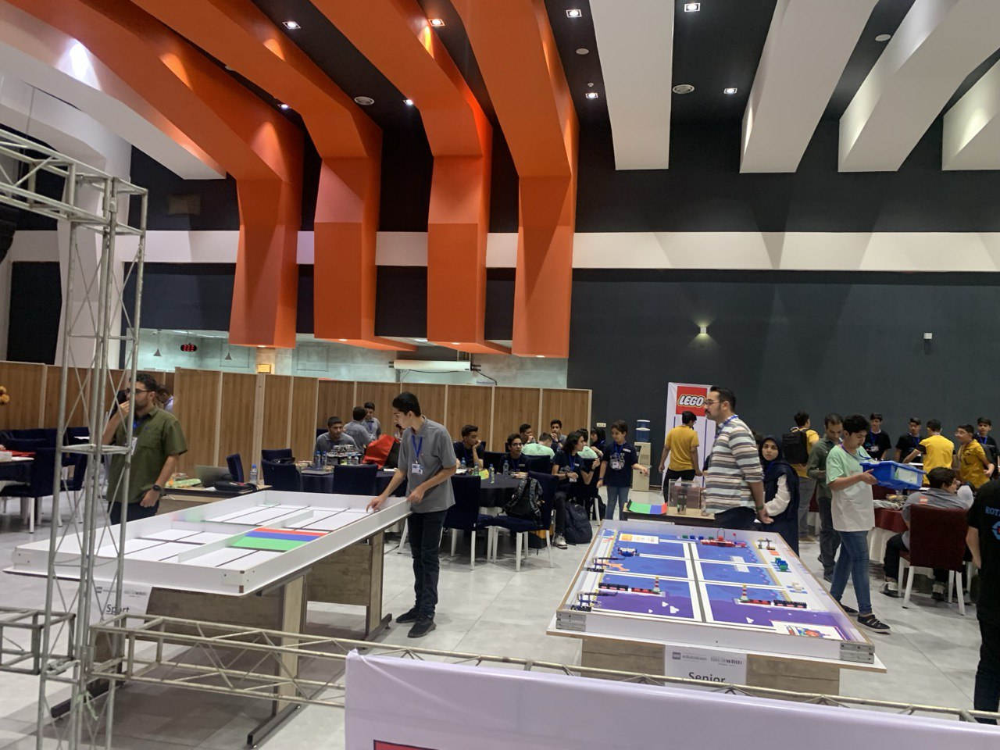
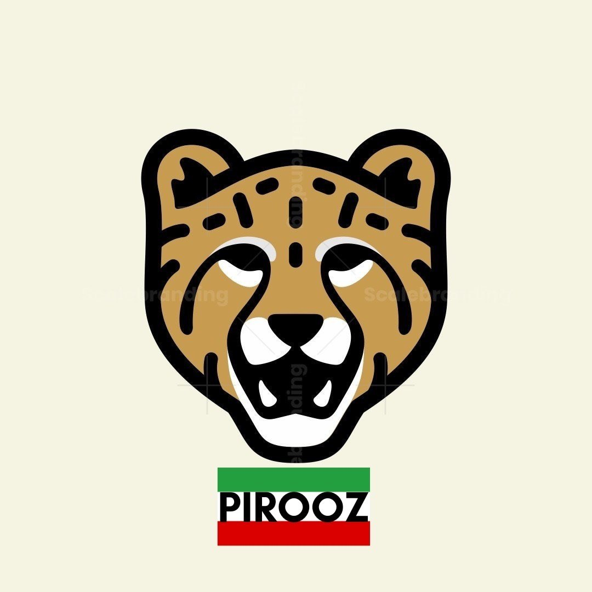

## مقدمه
امروز در مسابقات WRO ایران 2023 در *شیراز* شرکت کردم. تیم من و من در لیگ ماموریت رباتیک Senior رقابت کردیم. ما موفق به کسب *مقام اول* و *مدال طلا* شدیم.

---

## سناریو
جامعه مدرن امروزی به حمل و نقل کانتینری متکی است که انواع کالاها را از طریق دریا منتقل می‌کند. در گذشته، برخی مسیرها نیازمند سفرهای طولانی و خطرناک دور از سواحل قاره‌ها بودند، مانند عبور از «کاپ هورن» در آمریکای جنوبی یا «کاپ خوب» در آفریقا. اما ساخت کانال پاناما و کانال سوئز این امکان را فراهم کرده است که کشتی‌ها به سرعت و ایمنی بیشتری به مقصد خود برسند. بسیاری از کشتی‌های حمل و نقل مدرن حتی به استانداردهای پاناماکس یا نئواناماکس برای عبور از کانال پاناما ساخته شده‌اند.

استانداردسازی و اتوماسیون از دیگر جنبه‌هایی هستند که حمل و نقل بین‌المللی دریا را مؤثرتر کرده‌اند. معرفی کانتینرهای حمل و نقل استاندارد، نمونه‌ای از این استانداردسازی است. این کانتینرها می‌توانند به راحتی از کشتی به کامیون یا قطار منتقل شوند که باعث تسریع حمل و نقل می‌شود. در بنادر مدرن، بسیاری از فرآیندها خودکار شده‌اند، از جمله تخلیه کشتی‌ها و حتی هدایت کشتی‌ها. کشتی‌های خودران حتی چیزی است که می‌توانیم در آینده‌ای نزدیک انتظار داشته باشیم.

در زمین مسابقات Senior، ربات به بارگیری و تخلیه کشتی‌ها، سوخت‌رسانی به آنها و هدایت کشتی‌ها به دریا کمک خواهد کرد.

---

## ربات ما
بیشتر ربات‌های مسابقات WRO با [Lego EV3 Mindstorms](https://www.lego.com/en-us/product/lego-mindstorms-ev3-31313) ساخته می‌شوند و ربات ما نیز با همین پلتفرم ساخته شده بود.

### مشخصات
پردازشگر اصلی ربات ما یک EV3 بود. ما از سه موتور متوسط، یک موتور بزرگ و چهار سنسور رنگ-IR استفاده کردیم.

### طراحی
کدنویسی ربات با استفاده از [Lego Mindstorms EV3 Software](https://drive.google.com/file/d/15V1uK9sR5uAZCJJwds-hjwky9jYOFbDg/view?usp=sharing) انجام شد و طراحی ربات با استفاده از [Brick Studio 2.0](https://www.bricklink.com/v3/studio/download.page) انجام شد.

گیره ربات با استفاده از سیستم دندانه‌دار ساخته شد و الگوریتم دنبال‌کننده خط مورد استفاده، الگوریتم PID بود.

---

## گالری

### یکی از آزمایش‌های ما


### عکس‌ها

  
  
  
  
  
  
  

