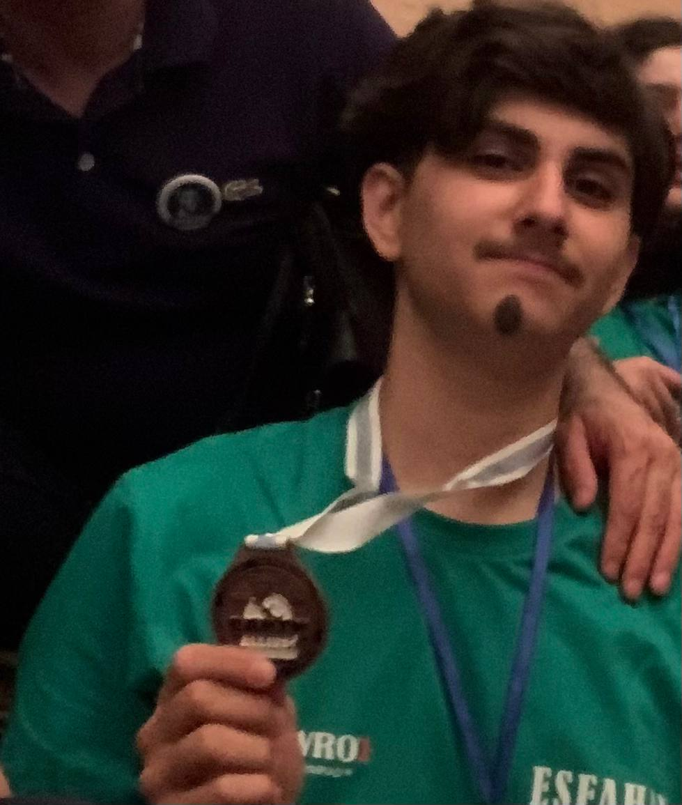

## مقدمه
امروز در مسابقات WRO ایران 2024 در *جزیره کیش* در لیگ تنیس دو نفره رباتیک شرکت کردم. ما موفق به کسب *مقام سوم* و *مدال برنز* شدیم.

## سناریو
**تنیس دو نفره**:  
هر مسابقه در این چالش شامل دو تیم از دانش‌آموزان است. هر تیم دو ربات آماده می‌کند. هر دو ربات در نیمه‌ی خود از زمین فعالیت می‌کنند و هدف آن‌ها همکاری در انجام یک کار مشترک است – بردن تمام توپ‌های نارنجی از نیمه خود به نیمه تیم مقابل.



## ربات ما
### مشخصات  
ربات ما از **آردوینو لئوناردو** به عنوان پردازشگر استفاده می‌کرد، چهار موتور DC زرد معمولی برای حرکت، دو موتور DC برای ضربه زن و یک **دوربین هوش مصنوعی UnitV** برای شناسایی توپ استفاده می‌شد.


### طراحی  
طراحی PCB با استفاده از **Altium Designer** انجام شد و *CAD* با استفاده از **SolidWorks** طراحی گردید. *IDE* ما **Arduino IDE** بود.



### طراحی ضربه زن  
ضربه زن به صورت یک منجنیق طراحی شده است، که از نیروی چرخشی برای برداشتن توپ و پرتاب آن به جلو استفاده می‌کند.

### الگوریتم  
هنگامی که ربات شروع به کار می‌کند، اسکن انجام می‌دهد تا موقعیت *توپ بنفش* را شناسایی کند. بر اساس موقعیت، مجموعه‌ای از دستورات برای بردن *توپ نارنجی* از نیمه خودی و حفظ *توپ بنفش* اجرا می‌شود. پس از آن، ربات به *حالت دوربین* می‌رود، جایی که دوربین یک صفحه **(X, Y)** ایجاد می‌کند. بر اساس موقعیت *توپ نارنجی*، اقدامات زیر انجام می‌شود:

```C
if (orange_y_coord > 50) {
    LEFT(90);
  } else if (orange_y_coord < -50) {
    RIGHT(90);
  } else if (orange_y_coord >= -50 && orange_y_coord <= 50 && orange_y_coord !=0) {
    FORWARDKICK();
  }
```

## گالری

### مثال یکی از الگوریتم ها


### عکس ها

  
  
  
  
  
  
  
