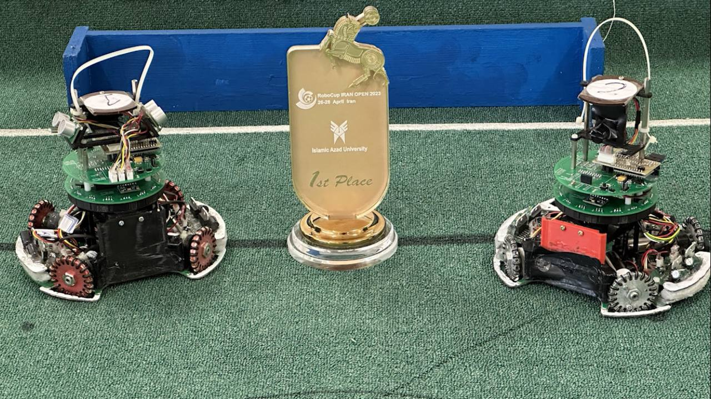

## Uvod
Leta 2023 sem se udeležil tekmovanja IranOpen 2023 RoboCup v *Teheranu* v ligi RCJ Lightweight Soccer z mojo ekipo **After X**. Dosegli smo **prvo mesto** in predstavljali Iran na tekmovanju v Bordeauxu.

---

## Naš robot
Imeli smo dva robota z enako mehansko in električno zasnovo, vendar z različnimi programi (eden kot vratar in drugi kot napadalec).

---

## Tehnične lastnosti

### Mikro
Mozg robota je **STM32F405RGT6**, ki ima *168 MHz*!!!

### Motorji
Naši roboti so uporabljali **Maxon DCX16L**, ki je zelo občutljiv in lahko doseže hitrosti do 1000RPM pri 9V napetosti.

### Pogonski gonilniki
Za pogon **Maxon DCX16L** smo uporabili **TB12FNG** gonilnike za vsak motor (skupaj 4).

### Premikanje
Premikanje robota je bilo omogočeno s pomočjo **4-kolesnega OmniDirectional premikanja**, ki omogoča robotu, da se premika v **vsako** smer.

### Prepoznavanje žoge
Iskanje žoge na igrišču, ki je IR oddajna žoga, smo izvedli s pomočjo **TSSP senzorjev** v krožni postavitvi.

### Prepoznavanje izhoda
Če je robot zapustil rob igrišča (bela črta okoli igrišča), je to pomenilo napako, zato smo namestili krožno postavitev **NJL senzorjev** za zaznavanje bele črte.

### Prepoznavanje gola
Napadalni robot je imel eno **OpenMV Cam H7** kamero in je zaznal gol, da je, ko je žoga bila v "ustih" robota, ta odšel proti golu.

---

## Galerija

fazili raziskovalni center

---

### Eden od naših tekem


### Fotografije


  
  
  
  
  
  

