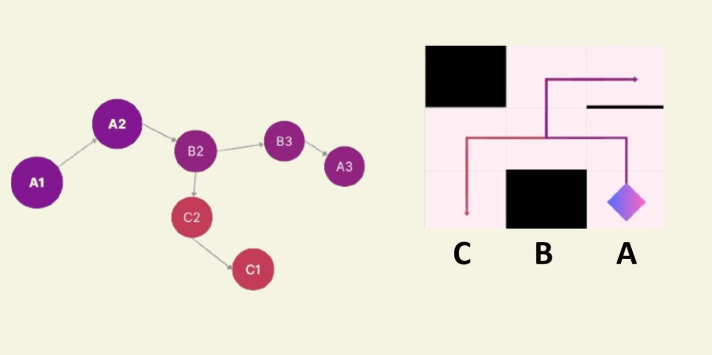
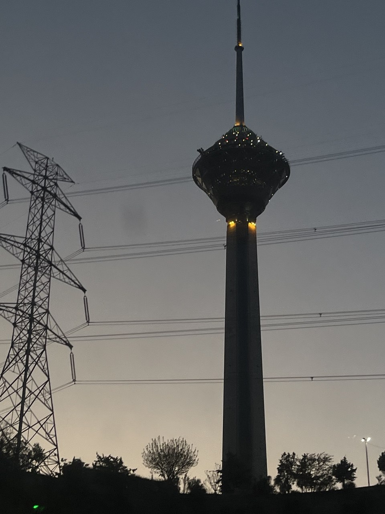

## Uvod
V tem letu smo pri RoboCupu izbrali drugačen pristop in se odločili za **Rescue** namesto **Soccer**. Letos smo tekmovali v **RCJ Rescue Maze**, vendar se naslednje leto načrtujemo tekmovati v **Rescue Line**.

---

## Tehnične lastnosti

### Mikro
Mozg robotov je **Raspberry Pi 4** in **Arduino Micro**.

### Servo motorji
Naš robot je uporabljal **Feetech STS3032**, kar je TTL pameten serijski servo.

### Kamera
Na obeh straneh robota je **Unit V** kamera, ki se uporablja za prepoznavanje poškodovanih (barva in črke).  
Obdelava slike poteka znotraj same kamere **Unit V**, koda v Pythonu pa je shranjena neposredno v mikrokamero.

### Algoritem za reševanje labirinta
Robot začne raziskovati labirint z uporabo algoritma globinskega iskanja **(DFS)**.  
Ko je celoten labirint preiskan, se robot, če je dovolj časa, vrne na začetno točko in zaključi krog.

Raziskovanje labirinta poteka z uporabo globinskega iskanja s prioritetno usmeritvijo.  
V tem algoritmu je labirint modeliran kot graf, robot pa išče vozlišča čim globlje.

### Padalnik reševalnega kompleta
Padalnik reševalnega kompleta v tem robotu je majhna in kompaktna naprava, navdihnjena z revolverjem.

---

## Galerija

### Fotografije


  
  
  
  
  

