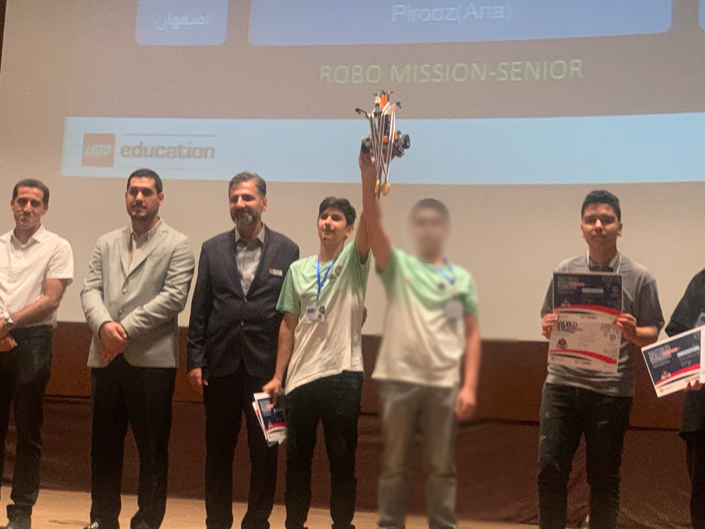

## Uvod
Danes je potekal WRO Iran 2023 v *Širazu*. Moj tim in jaz smo tekmovali v ligi RoboMission Senior. Dosegli smo *prvo mesto* in osvojili *zlato medaljo*.

---

## Scenarij
Naša sodobna družba se zanaša na pomorski prevoz kontejnerjev, ki transportira vse vrste blaga čez oceane. V preteklosti so bile določene poti, kjer so morali ladje opraviti dolga, nevarna potovanja okoli robov celin, kot na primer okoli Rta Horn v Južni Ameriki ali Rta Dobrega upanja v Afriki. Vendar sta gradnja Panamskega kanala in Sueškega kanala omogočila ladjam, da dosežejo svoj cilj veliko hitreje in varneje. Mnoge sodobne transportne ladje so bile celo zgrajene natančno po standardih Panamax ali novega Neopanamax: največje velikosti za prečkanje Panamskega kanala.

Standardizacija in avtomatizacija sta še drugi vidiki, ki sta naredili mednarodni pomorski prevoz učinkovitejši. Uvedba standardnih ladijskih kontejnerjev je primer te standardizacije. Ti kontejnerji se lahko enostavno prenesejo z ladje na tovornjak ali vlak, kar pospeši prevoz. V sodobnih pristaniščih je veliko procesov avtomatiziranih, kot je razkladanje ladij s kontejnerji in celo vodenje ladij. Avtonomne ladje so celo nekaj, kar lahko pričakujemo v bližnji prihodnosti.

Na igralnem polju Senior bo robot pomagal pri nalaganju in razkladanju ladij, jih napolnil in pilotiral do odprtega morja.

---

## Naš robot
Večina robotov v tekmovanju WRO je narejena z [Lego EV3 Mindstorms](https://www.lego.com/en-us/product/lego-mindstorms-ev3-31313), tako kot naš.

### Tehnične lastnosti
Glavni procesor našega robota je bil EV3. Imeli smo tri srednje motorje, en velik motor in štiri barvno-IR senzorje.

### Oblikovanje
Programiranje robota smo opravili z [Lego Mindstorms EV3 Software](https://drive.google.com/file/d/15V1uK9sR5uAZCJJwds-hjwky9jYOFbDg/view?usp=sharing), oblikovanje pa z [Brick Studio 2.0](https://www.bricklink.com/v3/studio/download.page).

Gripper je bil narejen s sistemom zobnikov, algoritem za sledenje liniji pa je bil PID algoritem.

---

## Galerija

### Eden od naših testnih poskusov


### Fotografije

  
  
  
  
  
  
  

