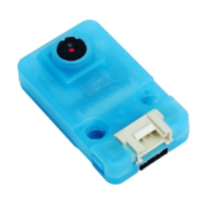

## Uvod
Danes sem tekmoval na WRO Iran 2024 na *Kish Island* v ligi RoboSports Double Tennis. Dosegli smo *tretje mesto* in osvojili *bronasto medaljo*.

## Scenarij
**Double-Tennis**:  
Vsaka tekma izziva vključuje dva študentska tima. Vsak tim pripravi dva robota. Oba robota delujeta na isti polovici igrišča, njun cilj pa je sodelovati pri skupnem nalogi – premakniti vse oranžne žoge iz svoje polovice na nasprotno polovico.



## Naš robot
### Tehnične lastnosti  
Naš robot je uporabljal **Arduino Leonardo** kot procesor, štiri običajne rumene DC motorje za gibanje, dva DC motorja za udarce ter **UnitV AI kamero** za zaznavanje žoge.



### Oblikovanje  
Oblikovanje PCB je bilo narejeno v **ALtium Designer**, CAD pa v **SolidWorks**. IDE, ki smo ga uporabili, je bil **Arduino IDE**.



### Oblikovanje udarca  
Udarni mehanizem je narejen kot katapulta, ki uporablja vrtilno silo za dviganje žoge in njeno metanje naprej.

### Algoritem  
Ko se je robot zagnal, je izvedel skeniranje za določitev položaja *ljubičaste žoge*. Na podlagi položaja je bil izveden sklop ukazov za premikanje *oranžne žoge* z naše strani, ob tem pa smo ohranili *ljubičasto žogo*. Po tem je robot prešel v *način kamere*, kjer je kamera ustvarila **(X,Y)** koordinatno ravnino. Na podlagi položaja *oranžne žoge* so bili sprejeti naslednji ukazi:

```C
if (orange_y_coord > 50) {
    LEFT(90);
  } else if (orange_y_coord < -50) {
    RIGHT(90);
  } else if (orange_y_coord >= -50 && orange_y_coord <= 50 && orange_y_coord !=0) {
    FORWARDKICK();
  }
  
```

## Galerija

### En primer algoritma


### Fotografije

  
  
  
  
  
  
  

